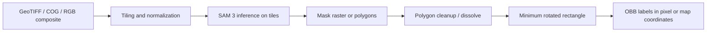

# Using Meta SAM 3 for Satellite Imagery Object Detection and Oriented Bounding Box Labeling Without Training

## Executive summary

The highest-confidence conclusion is that there is **no official Meta release of SAM 3 or SAM 3.1 that natively outputs oriented bounding boxes** for satellite imagery. Official SAM 3 outputs are masks, confidence scores, and **axis-aligned** boxes in `xyxy` pixel coordinates; for OBB labeling, you need a post-processing step that converts masks or polygons into rotated rectangles. The most reliable no-training workflow today is therefore: **GeoTIFF/COG → tiling/preprocessing → official SAM 3 inference → mask raster or polygons → OBB conversion with geospatially aware geometry tools**. citeturn43view5turn9view0turn26search0turn26search5turn26search3

For practical use on satellite and aerial imagery, the strongest off-the-shelf options are **official Meta SAM 3 weights** run through a geospatial wrapper such as urlopengeos/segment-geospatialturn14search17 or urlwalkerke/geosamturn14search4. Both are specifically designed for geospatial rasters; SamGeo is the best-supported Python path and documents GeoTIFF preservation, tiled inference, Docker usage, and SAM 3 examples, while geosam is the cleanest R path and explicitly supports GeoTIFF inputs plus chunking for large images. citeturn33view0turn34search0turn16search3turn40search2turn40search7

If your goal is **remote-sensing semantic/open-vocabulary extraction at very large scale**, the research-oriented urlearth-insights/SegEarth-OV-3turn14search8 is the most relevant SAM 3 adaptation I found. It keeps the workflow training-free, targets remote sensing explicitly, addresses patch-level false positives with a presence-guided filter, and reports inference on images larger than `10k × 10k`; however, it is **not** a turnkey OBB labeler and is more complex than SamGeo/geosam. citeturn28view5turn28view3turn28view4turn29view1turn29view2

If you need a **desktop annotation tool**, the combination of urlAnyLabeling docsturn36search1 plus the community ONNX export urlvietanhdev/segment-anything-3-onnx-modelsturn30search6 is attractive for human-in-the-loop work, and OBB editing is available in the related urlX-AnyLabeling rotated-rectangle docsturn32search2. But this path is less geospatially native than SamGeo/geosam, and the ONNX export’s license metadata conflicts with upstream Meta licensing, so it should be treated as a convenience build rather than the cleanest compliance path. citeturn36search3turn35view2turn35view3turn32search2

My overall recommendation is straightforward: **start with official `facebook/sam3` weights, not unofficial mirrors; use SamGeo3 for Python or geosam for R; export georeferenced masks; compute OBBs in a projected CRS with Shapely or PostGIS; and keep the authoritative label artifact as a polygon or four-corner rotated rectangle rather than an axis-angle tuple whenever possible.** citeturn42search4turn15view0turn40search2turn26search0turn37search0turn26search3

## Official Meta releases and downloadable weights

Meta’s official SAM 3 release is a **general-purpose** image/video foundation model, not a satellite-specialized one. The official project page and paper describe **promptable concept segmentation** from text prompts and exemplars, plus visual prompting and video tracking. The official code repository documents Python/CUDA requirements, notebook examples, and model loading; the official Hugging Face pages host the gated checkpoints. I did **not** find an official Meta checkpoint specialized for satellite imagery, multispectral imagery, SAR, geospatial metadata, or OBB output. citeturn42search1turn42search3turn43view5turn10view0turn11view0

### Official release inventory

| Official release | Official download page | License | Published weight artifacts | Published model size | Native image size / practical limit | Supported tasks | OBB support | Notes |
|---|---|---|---|---|---|---|---|---|
| urlMeta AI SAM 3 pageturn42search1 / urlfacebook/sam3 model pageturn42search4 / urlfacebookresearch/sam3 repoturn12search2 | urlfacebook/sam3 files treeturn5view0 | SAM License | `model.safetensors` 3.45 GB; `sam3.pt` 3.45 GB | Repo states **848M parameters**; HF surfaces it as ~0.9B | Transformers docs say the model is meant to be used at **1008 px**; custom sizes are possible but may reduce accuracy | Text-prompt concept segmentation, exemplar prompting, point/box/mask prompting, masks + scores + boxes, video tracking | **No native OBB**; boxes are axis-aligned `xyxy` | Gated on Hugging Face; official repo requires authentication to download. citeturn5view0turn43view5turn9view0turn13view1 |
| urlfacebook/sam3.1 model pageturn10view0 / urlSAM 3.1 blog postturn42search5 | urlfacebook/sam3.1 files treeturn11view0 | SAM License | `sam3.1_multiplex.pt` 3.5 GB | Meta does not clearly publish a separate parameter count on the pages I found | Same family; no separate official image-size note surfaced on the model card I found | Faster multi-object video tracking via Object Multiplex; built on SAM 3 | **No native OBB** | The HF card explicitly says this repo hosts only checkpoints and that there is **no Transformers integration**. citeturn10view0turn11view0 |

A few details matter operationally. The official repo lists **Python 3.12+, PyTorch 2.7+, and a CUDA-compatible GPU with CUDA 12.6+** as prerequisites, and shows a standard editable install flow with `git clone`, `pip install -e .`, and authenticated checkpoint download. The same README shows that the basic image API returns `masks`, `boxes`, and `scores`, which is enough for object detection-style workflows but still stops short of geospatial OBB labeling. citeturn43view0turn43view5

The official Hugging Face/Transformers documentation is also quite important because it makes the image-size and output semantics explicit: the default `image_size` is **1008**, the model is “meant to be used at 1008px resolution,” and the post-processed output contains masks plus **absolute pixel-coordinate boxes in `xyxy` format**. That is the clearest evidence that OBB generation is a downstream conversion problem rather than an upstream model feature. citeturn9view0

## Community ecosystem, third-party checkpoints, and model zoos

The useful community landscape splits into three buckets: **geospatial wrappers around official weights**, **remote-sensing-specific research adaptations**, and **unofficial repackagings or mirrors**. The first bucket is the most trustworthy for production-ish no-training workflows; the second is useful when you need stronger remote-sensing semantics; the third is convenient but materially riskier from a provenance and licensing perspective. citeturn15view0turn15view2turn15view4turn30search1turn31view0

### Community inventory

| Option | What it is | Satellite / geospatial focus | OBB path | Provenance and trustworthiness | License | Recommendation |
|---|---|---|---|---|---|---|
| urlopengeos/segment-geospatialturn14search17 | Python geospatial wrapper around SAM-family models, including documented SAM 3 examples | **High**: GeoTIFF segmentation, vector export, interactive maps, tiled inference, Docker, REST API | Export masks or polygons, then convert to OBB | **High**: well-maintained geospatial wrapper with docs and examples | MIT | **Best Python starting point**. citeturn15view0turn16search3turn33view0turn34search0 |
| urlwalkerke/geosamturn14search4 | R package wrapping Meta SAM 3 for georeferenced imagery | **High**: GeoTIFF input, satellite imagery workflows, bbox download sources, chunked large-image handling | Convert returned polygons to OBB in `sf`/GEOS | **High–medium**: author-maintained wrapper with detailed docs | License not clearly surfaced in the parsed material I found; verify before deployment | **Best R path**. citeturn15view2turn15view3turn40search2turn40search6turn40search7 |
| urlearth-insights/SegEarth-OV-3turn14search8 | Training-free SAM 3 adaptation for remote-sensing open-vocabulary segmentation | **Very high**: designed for remote sensing, large scenes, building/road/water/change tasks | Connected-components or instance aggregation, then OBB | **Medium–high**: research repo and paper; more complex stack | Repo license not clearly surfaced in the parsed page; verify before use; associated HF model card below is MIT | **Strong research-grade option** for large remote-sensing scenes, not the easiest OBB tool. citeturn28view5turn28view3turn29view1turn29view2 |
| urlBiliSakura/SegEarth-OV model cardturn22search9 | HF model packaging for SegEarth-OV, tagged `remote-sensing`, `earth-observation`, `sam3` | **High** for semantic/open-vocabulary remote sensing | Semantic masks → region extraction → OBB | **Medium**: community packaging, but clearly tied to the SegEarth family | MIT on model card | Useful if you specifically want the SegEarth route. citeturn23view0turn23view1 |
| urlGeo-SAM QGIS plugin docsturn40search1 / urlcoolzhao/Geo-SAM repoturn20search2 | QGIS plugin built on original SAM with pre-encoding for fast remote-sensing interaction | **High** for geospatial/manual work; supports 1–2 band and SAR adaptations | Manual segmentation → OBB via GIS tools | **Medium–high**: mature geospatial tool, but **not SAM 3** | MIT | Good fallback for CPU/manual workflows, but outside your preferred SAM 3 path. citeturn41view0turn41view1 |
| urlvietanhdev/segment-anything-3-onnx-modelsturn30search6 | Community ONNX export of SAM 3 for `onnxruntime` and AnyLabeling | **Low–medium** geospatially; useful for local/dependency-light labeling | AnyLabeling + rotated-rectangle editing or downstream conversion | **Medium** engineering provenance, but license metadata conflicts with upstream Meta license claim | Card says Apache-2.0, but also says “license unchanged from upstream (Apache 2.0),” which conflicts with official SAM License | Use **only** if you need ONNX/desktop convenience and have cleared license questions. citeturn35view2turn35view3turn13view1 |
| urlonnx-community/sam3-tracker-ONNXturn30search2 | ONNX/Transformers.js tracker package derived from `facebook/sam3` | Low satellite focus | Point/box prompts → masks → OBB | **Medium**: useful deployment artifact, but page does not clearly surface license and it is tracker-centric | License not clearly surfaced on page I found | Useful mostly for browser/JS interactive prompting, not my first satellite recommendation. citeturn31view1turn35view0 |
| url1038lab/sam3 mirrorturn30search1 | Unofficial mirror of official SAM 3 weights | None; general-purpose SAM 3 | Same as official after download | **Low**: explicitly a mirror, not the official host | “other” / upstream-style terms | I do **not** recommend this unless official access is impossible and you have separately cleared legal/compliance concerns. citeturn30search1turn30search0turn13view1 |

A useful nuance: the most mature **remote-sensing** community options are still mostly **wrappers and post-processors around official weights**, not entirely new zero-training “satellite SAM 3 OBB models.” The strongest evidence for that is that both SamGeo3 and geosam require the official Hugging Face access path, while SegEarth-OV3 explicitly tells users to download SAM 3 checkpoints from Hugging Face or ModelScope and build its remote-sensing pipeline on top. citeturn15view2turn40search7turn29view1turn29view3

## Ready-to-use pipelines and how they produce OBB labels

The practical architecture is simpler than the tooling landscape makes it seem. You do **not** need a special OBB-capable SAM 3 checkpoint. You need a reliable way to run inference on geospatial rasters and a reliable way to convert masks into rotated rectangles. citeturn33view0turn26search0turn26search5



This diagram reflects the documented behavior of the official SAM 3 code and the geospatial wrappers: large rasters are tiled, masks are produced per tile or per scene, georeferencing can be preserved in GeoTIFF outputs, and rotated boxes are a deterministic geometric post-process downstream of the mask. citeturn34search0turn33view0turn26search2turn26search0turn26search3

### Pipeline comparison

| Pipeline | Download / repo | Install style | Example command or entry point | GeoTIFF / COG awareness | Native OBB output | GPU / CPU expectations | Ease of use |
|---|---|---|---|---|---|---|---|
| Official upstream SAM 3 | urlfacebookresearch/sam3 repoturn12search2 | `git clone` + `pip install -e .` | `build_sam3_image_model()` / `Sam3Processor` | No geospatial niceties by default; you must add raster IO yourself | No | Official docs require CUDA GPU | Medium for ML engineers; lower for geospatial analysts. citeturn43view0turn43view5 |
| SamGeo3 | urlsegment-geospatial docsturn16search1 | `pip`, `conda`, `pixi`, Docker | `SamGeo3(...).set_image(...).generate_masks(...)` | **Yes**: GeoTIFF IO, georeference preservation, tiled segmentation, vector export | No, but masks/vector export make OBB easy | Docs say SAM 3 currently needs NVIDIA GPU; Docker image exists | **High**. citeturn33view0turn16search3turn34search0 |
| geosam | urlgeosam siteturn40search7 | R package + helper installer | `sam_detect(image = "scene.tif", text = "building")` | **Yes**: georeferenced imagery, chunking for large images | No | Depends on installed Python env and SAM 3 access; docs focus on streamlined setup | **High** if you live in R. citeturn40search2turn40search6turn15view3 |
| SegEarth-OV3 | urlearth-insights/SegEarth-OV-3turn14search8 | Research repo with `mmcv`/`mmsegmentation` | `python demo.py` | Yes, via patch-level remote-sensing pipeline | No native OBB | Complex Python stack; likely GPU for practical use | Medium–low unless you need its remote-sensing semantics. citeturn29view1turn29view2 |
| Ultralytics SAM 3 | urlUltralytics SAM 3 docsturn24search0 | `pip install -U ultralytics` | `SAM3SemanticPredictor` | Not geospatial-native; ideal for already prepared RGB chips | No native OBB | Uses local `sam3.pt`; GPU strongly preferable | Medium. Good for chip-based inference. citeturn25view0 |
| AnyLabeling + ONNX | urlAnyLabeling docsturn36search1 + urlONNX export modelturn30search6 | Desktop app / ONNX artifacts | GUI smart-labeling | Not geospatial-native | OBB via manual rotated-rectangle editing, not true auto OBB | Can run with ONNX Runtime; deployment lighter than PyTorch | Good for annotation assistants, weaker for geospatial rigor. citeturn36search3turn32search2turn35view2 |

### Recommended ready-to-use paths

If you want **the shortest path to georeferenced OBB labels**, use **SamGeo3 + official SAM 3 weights + Shapely OBB conversion**. SamGeo3’s examples show GeoTIFF input, text-prompt segmentation, GeoTIFF-preserving mask export, confidence-score export, and dedicated tiled segmentation for large rasters. That is almost exactly the workflow you asked for; the only missing step is the OBB conversion, which is easy to add. citeturn33view0turn34search0

If you want **remote-sensing-specific semantics at large scene scale**, use **SegEarth-OV3 + official SAM 3 weights**, but be aware that it is a semantic/open-vocabulary remote-sensing research stack rather than a turnkey dataset-labeling product. It is strongest when your prompts are things like “building,” “road,” “water,” or change-detection classes over large scenes. citeturn28view5turn28view3turn29view1

If you want **human-in-the-loop annotation with local files on a desktop**, the best balance is **AnyLabeling or X-AnyLabeling with SAM 3** and then rotate/correct boxes manually. This is practical for hand-curated OBB datasets, but it does not preserve geospatial metadata in the way SamGeo/geosam-based pipelines do. citeturn36search1turn36search2turn32search2

## Converting SAM masks to oriented bounding boxes

The important design choice is **where** to compute the OBB:

- **Pixel-space OBB** is right if your downstream label format is image-native and your raster chips are already north-up, square-pixel RGB tiles.
- **Map-space OBB** is right if you need geospatially correct orientation, dimensions in meters, or vector labels for GIS/DB storage.
- For georeferenced rasters, compute OBBs in a **projected CRS** after polygonization, not in latitude/longitude and not by pretending pixel coordinates are map coordinates when the raster has non-trivial geotransform terms. citeturn26search3turn26search2turn26search0turn37search0

### Algorithms worth using

| Algorithm | Library / function | Best use | Strengths | Caveats |
|---|---|---|---|---|
| Minimum-area rotated rectangle from polygon | entity["software","Shapely","Python computational geometry library"] `minimum_rotated_rectangle` / `oriented_envelope` | Geospatial polygon outputs | Deterministic, geospatially clean, works directly on polygons | Degenerate inputs can return a point or line, not a polygon. citeturn26search0turn26search12 |
| Minimum-area rotated rectangle from contour points | entity["software","OpenCV","computer vision library"] `cv.minAreaRect()` | Pixel-space object detection labels | Fast, standard CV primitive, easy for chip workflows | Works in pixel coordinates only unless you separately georeference corners. citeturn26search5turn26search9 |
| Polygonize raster masks | entity["software","Rasterio","Python raster I/O library"] `rasterio.features.shapes()` | Turning SAM mask rasters into vector polygons | Respects raster transform, fits geospatial workflow | Raw polygonization can create noisy/slivery polygons; cleanup is often needed. citeturn26search2turn26search6 |
| SQL-oriented envelope | entity["software","PostGIS","spatial extension for PostgreSQL"] `ST_OrientedEnvelope()` | Database-native GIS pipelines | Excellent if masks/polygons already live in a spatial DB | Same degenerate-geometry caveat as GEOS/Shapely. citeturn37search0turn37search12 |
| PCA-aligned rectangle | entity["software","scikit-learn","machine learning library"] `PCA` | Heuristic stabilization for long thin footprints | Often stable for elongated targets | Not guaranteed to be minimum-area enclosing. citeturn39search0turn39search1 |

### Recommended conversion pattern

For most satellite OBB labeling, the best pattern is:

1. Run SAM 3 and save a **mask GeoTIFF** or vector polygons.
2. Polygonize mask regions.
3. Clean polygons: remove tiny holes/slivers, optionally dissolve touching fragments belonging to the same instance.
4. Reproject polygons to a **local projected CRS** if you care about angle/size in meters.
5. Compute `minimum_rotated_rectangle`.
6. Export the result either as:
   - a four-corner polygon in map coordinates;
   - a four-corner polygon in pixel coordinates;
   - or an `(xc, yc, w, h, angle)` representation derived from the rectangle corners.

That approach is the most robust because Shapely/PostGIS compute the oriented rectangle on actual object geometry, whereas trying to infer orientation directly from SAM’s axis-aligned detection box throws away the very boundary detail that makes SAM useful for OBB labeling. citeturn26search0turn37search0turn9view0

### Minimal Python snippet for mask-to-OBB conversion

```python
import rasterio
from rasterio.features import shapes
import geopandas as gpd
from shapely.geometry import shape

mask_tif = "building_masks.tif"   # GeoTIFF written by SamGeo/SAM3 workflow
out_gpkg = "building_obb.gpkg"

records = []
with rasterio.open(mask_tif) as src:
    mask = src.read(1)
    mask_bool = mask > 0

    for geom, value in shapes(mask, mask=mask_bool, transform=src.transform):
        poly = shape(geom)
        if poly.is_empty:
            continue
        # Simple cleanup if needed:
        poly = poly.buffer(0)

        obb = poly.minimum_rotated_rectangle
        records.append({"value": int(value), "geometry": obb})

gdf = gpd.GeoDataFrame(records, crs=src.crs)

# Optional but recommended for metric angles/width/height:
# gdf = gdf.to_crs(gdf.estimate_utm_crs())

gdf.to_file(out_gpkg, driver="GPKG")
print(f"Saved {len(gdf)} oriented boxes to {out_gpkg}")
```

This uses georeferenced polygonization from entity["software","Rasterio","Python raster I/O library"] and minimum rotated rectangles from entity["software","Shapely","Python computational geometry library"]. For database workflows, the same logic maps directly to `ST_OrientedEnvelope()` in entity["software","PostGIS","spatial extension for PostgreSQL"]. citeturn26search2turn26search6turn26search0turn37search0

### Accuracy caveats for georeferenced imagery

The biggest avoidable mistake is computing OBBs in **EPSG:4326** or on raw pixel coordinates when you actually need **map-space** boxes. GDAL’s geotransform model makes it explicit that raster-to-map conversion can include pixel size and rotation terms; if you ignore those terms, your OBB angle and dimensions can be wrong. Similarly, the minimum rotated rectangle is sensitive to fragmented/noisy polygons, and both Shapely and PostGIS note that degenerate shapes can return lines or points. citeturn26search3turn26search0turn37search0

For satellite imagery specifically, there are three recurring failure modes:

- **Tile seam fragmentation**, which splits one real object into multiple masks.
- **Dense small objects**, where SAM 3 can miss or fragment instances.
- **Patch-level false positives** in large geospatial scenes.

SegEarth-OV3 explicitly addresses the second and third issues with mask fusion and presence-guided filtering; SamGeo’s tiled workflow addresses the first with overlap between tiles. citeturn28view0turn28view1turn28view3turn34search0

## GeoTIFF, COG, multispectral compatibility and preprocessing

### What works well

**GeoTIFF** is the safest base format for this use case. SamGeo’s SAM 3 examples show GeoTIFF input and explicitly state that saving masks from a GeoTIFF preserves georeferencing in the output GeoTIFF. geosam’s `sam_detect()` also accepts a **GeoTIFF image path** directly. citeturn33view0turn40search2

**COG** is well-supported operationally, even if the most turnkey examples still use local GeoTIFF files. SamGeo exposes an `image_to_cog()` utility that converts an image or dataset path to a Cloud Optimized GeoTIFF profile, which is useful for storage and serving even if you perform inference locally on tiles. citeturn18search3

### What needs adaptation

Official SAM 3 is fundamentally a **3-channel** image model. The Transformers config exposes `num_channels = 3`, and the remote-sensing community tools that explicitly add 1-band/2-band/SAR support do so in **non-SAM3** tools like Geo-SAM. So for SAM 3 proper, the most conservative recommendation is to reduce multispectral data to an RGB or false-color 3-band composite before inference. citeturn9view0turn41view0turn41view1

### Recommended preprocessing

For satellite OBB labeling, I recommend the following default preprocessing stack:

- **Resample to a sensible GSD for the target object size**. The earlier remote-sensing SAM paper found that SAM performance drops on lower-spatial-resolution imagery, so the best zero-training results still come from sharper imagery and appropriately sized objects. citeturn27view0
- **Tile large rasters**. SamGeo’s tiled SAM 3 example is directly on point: it divides large images into overlapping tiles, processes them independently, merges outputs, and preserves georeferencing. The documented defaults are `tile_size=1024` and `overlap=128`. citeturn34search0
- **Normalize to a visually meaningful 3-band composite**. Because official SAM 3 expects 3 channels, stretch or clip bands into a stable RGB space before inference rather than feeding arbitrary multispectral tensors. citeturn9view0
- **Use text prompts conservatively**. Official SAM 3 is designed around **short noun phrases**, not long compositional descriptions. For remote sensing, prompts like `building`, `roof`, `road`, `ship`, `solar panel`, or `aircraft` are more reliable than long descriptive queries. citeturn42search1turn25view0
- **Filter tiny masks and seam artifacts**. Both SamGeo and geosam expose size/threshold/chunking controls that matter a lot on overhead imagery. citeturn34search0turn40search2

### Minimal reproducible example with GeoTIFF input and OBB output

This is the cleanest end-to-end no-training example I would hand to a practitioner today.

```bash
pip install "segment-geospatial[samgeo3]" rasterio geopandas shapely
pip install "transformers==5.0.0rc0"
hf auth login
```

```python
from samgeo import SamGeo3
import rasterio
from rasterio.features import shapes
import geopandas as gpd
from shapely.geometry import shape

# 1) Load official SAM 3 weights through SamGeo3
sam3 = SamGeo3(backend="meta", device=None, checkpoint_path=None, load_from_HF=True)

# 2) Run inference on a GeoTIFF with a short text prompt
image_path = "scene.tif"
prompt = "building"

sam3.set_image(image_path)
sam3.generate_masks(prompt=prompt)

# 3) Save georeferenced masks
mask_tif = "building_masks.tif"
sam3.save_masks(output=mask_tif, unique=True)

# 4) Convert masks to oriented rectangles
rows = []
with rasterio.open(mask_tif) as src:
    arr = src.read(1)
    for geom, value in shapes(arr, mask=(arr > 0), transform=src.transform):
        poly = shape(geom).buffer(0)
        if poly.is_empty:
            continue
        obb = poly.minimum_rotated_rectangle
        rows.append({"instance_id": int(value), "geometry": obb})

gdf = gpd.GeoDataFrame(rows, crs=src.crs)

# Optional: reproject to projected CRS before measuring width/height/angle
# gdf = gdf.to_crs(gdf.estimate_utm_crs())

gdf.to_file("building_obb.geojson", driver="GeoJSON")
print(gdf.head())
```

This example is directly grounded in SamGeo’s documented SAM 3 setup and GeoTIFF-preserving save path, plus Rasterio polygonization and Shapely OBB geometry. citeturn33view0turn15view1turn26search2turn26search0

### Minimal reproducible example with official upstream code and raster tiling

If you want the canonical upstream route with no third-party wrapper, this is the minimal pattern:

```bash
conda create -n sam3 python=3.12
conda activate sam3
pip install torch==2.10.0 torchvision --index-url https://download.pytorch.org/whl/cu128
git clone https://github.com/facebookresearch/sam3.git
cd sam3
pip install -e .
hf auth login
```

```python
import numpy as np
import rasterio
from PIL import Image
from sam3.model_builder import build_sam3_image_model
from sam3.model.sam3_image_processor import Sam3Processor

# Read one RGB tile/chip from a GeoTIFF
with rasterio.open("scene.tif") as src:
    window = rasterio.windows.Window(col_off=0, row_off=0, width=1008, height=1008)
    rgb = src.read([1, 2, 3], window=window)  # adapt bands as needed
    rgb = np.transpose(rgb, (1, 2, 0))
    tile = Image.fromarray(rgb.astype(np.uint8))

model = build_sam3_image_model()
processor = Sam3Processor(model)

state = processor.set_image(tile)
output = processor.set_text_prompt(state=state, prompt="building")

masks = output["masks"]
boxes = output["boxes"]   # axis-aligned xyxy, not OBB
scores = output["scores"]
print(type(masks), len(boxes), scores[:5] if len(scores) else scores)
```

After this point, you would convert the returned masks to OBBs exactly as in the SamGeo example; you just need to stitch tile coordinates back into full-image pixel or map coordinates yourself. citeturn43view0turn43view5turn9view0

## Recommended pretrained weights to try, limitations, and source priorities

### Ranked weights and stacks to try first

| Rank | Weight / stack | Why it ranks here | Best-fit use case |
|---|---|---|---|
| Best overall | **Official** urlfacebook/sam3turn42search4 **+** urlSamGeo3turn14search17 | Best balance of provenance, geospatial IO, tiled inference, GeoTIFF-preserving output, and low engineering friction | Python-based satellite OBB labeling. citeturn33view0turn34search0turn13view1 |
| Best R workflow | **Official** urlfacebook/sam3turn42search4 **+** urlgeosamturn14search4 | Geospatial and analyst-friendly, chunking for large images, clean R API | R/GIS teams needing no-training GEO workflows. citeturn40search2turn40search7 |
| Best remote-sensing semantics | **Official** urlfacebook/sam3turn42search4 **+** urlSegEarth-OV3 repoturn14search8 or urlSegEarth-OV HF modelturn22search9 | Explicit remote-sensing adaptation, large-scene handling, presence-guided filtering | Buildings/roads/water/change tasks over huge overhead scenes. citeturn28view5turn28view3turn29view1 |
| Best canonical control | **Official** urlfacebookresearch/sam3 repoturn12search2 only | Cleanest provenance, direct access to full upstream behavior | Engineers who want full control over raster tiling and label export. citeturn43view5turn13view1 |
| Best desktop convenience | urlAnyLabeling docsturn36search1 **+** urlvietanhdev ONNX exportturn30search6 | Lowest operational friction for interactive labeling | Human-in-the-loop label drafting, especially if geospatial metadata is not essential in the UI. citeturn36search3turn35view2turn32search2 |

### Limitations and mitigation strategies

**No native OBB output.** This is the biggest structural limitation. Official outputs are masks and axis-aligned boxes, so every OBB pipeline is downstream geometry. Mitigation: treat masks or polygons as the authoritative artifact and generate rotated rectangles deterministically from them. citeturn9view0turn43view5turn26search0

**No official satellite-specialized SAM 3 checkpoint.** The official release is broad and strong, but not EO-specialized. Mitigation: start with official weights and, if your prompts are land-cover/EO-specific or scenes are huge, move to SegEarth-OV3 before considering anything more exotic. citeturn42search1turn42search4turn28view5

**Small and dense targets remain hard.** SegEarth-OV3’s paper is explicit about dense/small remote-sensing targets and patch-level false positives; earlier remote-sensing SAM work also reported weaker performance on lower-resolution imagery. Mitigation: use high-resolution imagery, overlap in tiling, size filtering, prompt refinement, and manual review on crowded scenes. citeturn28view0turn28view1turn27view0turn34search0

**Large-scene memory pressure.** Official SAM 3 is meant for 1008 px inference and upstream requires modern CUDA. Mitigation: tile aggressively; SamGeo’s tiled inference defaults are a good baseline. citeturn9view0turn43view0turn34search0

**Multispectral and SAR friction.** Official SAM 3 is 3-channel; Geo-SAM’s 1–2 band/SAR handling is useful evidence that this matters in practice, but that tool is based on original SAM rather than SAM 3. Mitigation: prepare a carefully chosen RGB or false-color composite for SAM 3, or use a non-SAM3 tool only when sensor compatibility matters more than SAM 3 capability. citeturn9view0turn41view0turn41view1

**Licensing / access ambiguity in community repacks.** Official Meta checkpoints are gated and governed by the SAM License. Some community exports or mirrors either bypass gating or claim conflicting license metadata. Mitigation: prefer official `facebook/sam3` downloads; use community repacks only after an explicit policy review. citeturn13view1turn30search1turn35view2turn35view3

### Prioritized source list

| Priority | Source | Why it should anchor decisions |
|---|---|---|
| Highest | urlMeta AI SAM 3 pageturn42search1 | Canonical capabilities and public positioning from Meta. |
| Highest | urlfacebookresearch/sam3 repoturn12search2 | Canonical code, prerequisites, outputs, and install path. |
| Highest | urlfacebook/sam3 model pageturn42search4 and urlfacebook/sam3.1 model pageturn10view0 | Canonical weight hosting and access conditions. |
| Highest | urlTransformers SAM 3 docsturn8view0 | Most explicit public statement of image size and `xyxy` box semantics. |
| Very high | urlSamGeo docsturn16search1 and urlSamGeo SAM 3 examplesturn33view0 | Best practical geospatial wrapper documentation. |
| Very high | urlgeosam docsturn40search7 and urlsam_detect referenceturn40search2 | Best R/geospatial operational documentation. |
| High | urlSegEarth-OV3 repoturn14search8 and urlSegEarth-OV3 paper pageturn22search0 | Best remote-sensing-specific SAM 3 adaptation I found. |
| High | urlShapely minimum_rotated_rectangle docsturn26search0, urlOpenCV minAreaRect docsturn26search5, urlRasterio features docsturn26search2, urlGDAL geotransform docsturn26search3 | Core geometric and geospatial primitives for OBB conversion. |
| Medium | urlAnyLabeling docsturn36search1 and urlX-AnyLabeling rotated rectangle docsturn32search2 | Useful for annotation UX, but not geospatial-native. |
| Low | url1038lab mirrorturn30search1 and urlvietanhdev ONNX exportturn30search6 | Convenience artifacts only; use with provenance/licensing caution. |

### Open questions and reporting limits

I did **not** find a clearly documented, officially supported **SAM 3.1 geospatial wrapper** equivalent to today’s SamGeo3/geosam documentation, so my practical recommendations remain centered on **SAM 3** rather than **SAM 3.1** for satellite OBB labeling. citeturn10view0turn15view0turn40search7

I also found a few Hugging Face SAM 3 fine-tuned listings for remote sensing, but their **public documentation was too thin to verify provenance, licensing, and inference behavior rigorously**, so I excluded them from the recommendation shortlist rather than give you low-confidence advice. citeturn20search0